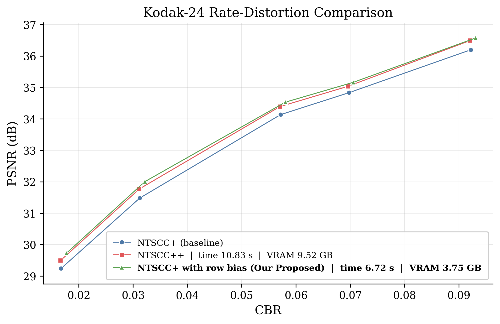

# Fit More, Transmit Better: 
# Leveraging Overfitting for Image JSCC

Official PyTorch implementation of our paper:

> **Fit More, Transmit Better: Leveraging Overfitting for Image JSCC**

This repository packages the **efficient NTSCC+ test-time fine-tuning pipeline** used in our work on image JSCC. The focus of this public release is practical online adaptation: improving image-specific reconstruction quality while keeping **encoding latency** and **GPU memory usage** much lower than heavy full-overfitting baselines such as **NTSCC++**.

## Release scope

This repository currently releases the **NTSCC+ fine-tuning part only**:

- NTSCC+ baseline evaluation
- lightweight per-image online adaptation
- optional side-by-side comparison against NTSCC++
- logging of PSNR, CBR, runtime, peak memory, and tuned parameter count

This is a **clean public subset** of our internal research codebase. Some internal utility names still reflect the original experimental environment, but the recommended public entry point is the script below:

```bash
python run_ntsccplus_finetune_eval.py ...
```

## Highlights

- Lightweight **test-time adaptation** for NTSCC+
- Optional **NTSCC++** comparison under the same evaluation setting
- Clean CSV outputs for paper tables and plots
- Minimal wrappers around the original NTSCC+ implementation
- Designed for **reproducible Kodak-style evaluation**

## Repository structure

```text
.
├── run_ntsccplus_finetune_eval.py   # main public entry point
├── test_time_eval/                  # internal evaluation backend used by the public entry point
├── NTSCC_plus_plus/                 # optional NTSCC++ comparison utilities
├── row_bias_ntscc/                  # lightweight wrappers around the original NTSCC+ codebase
├── row_bias_quant_lab.py            # internal utility used by the backend
├── assets/
│   └── kodak_result.png             # example qualitative/curve figure
├── requirements.txt
├── .gitignore
└── CITATION.cff
```

## Environment

We recommend Python 3.10+ and PyTorch with CUDA support.

Install PyTorch and torchvision according to your local CUDA version first. Then install the remaining dependencies:

```bash
pip install -r requirements.txt
```

## External dependency

This repository expects access to the **original NTSCC+ codebase and pretrained checkpoints**.

You can either pass paths explicitly through command-line arguments or define environment variables:

```bash
export NTSCC_REPO_ROOT=/path/to/NTSCC_plus
export NTSCC_DATASET_ROOT=/path/to/Dataset
```

Typical directory layout:

```text
/path/to/NTSCC_plus/
├── checkpoint/
└── ...

/path/to/Dataset/
└── kodak/
```

## Quick start

### 1) Run NTSCC+ baseline + lightweight fine-tuning

```bash
python run_ntsccplus_finetune_eval.py \
  --ntscc_repo_root /path/to/NTSCC_plus \
  --checkpoint_dir /path/to/NTSCC_plus/checkpoint \
  --image_dir /path/to/Dataset/kodak \
  --checkpoint_indices 0,1,2,3,4 \
  --num_images 24 \
  --s_steps 20 \
  --s_lr 0.1 \
  --output_dir outputs/kodak_s_only \
  --device cuda \
  --overwrite
```

### 2) Compare with NTSCC++

```bash
python run_ntsccplus_finetune_eval.py \
  --ntscc_repo_root /path/to/NTSCC_plus \
  --checkpoint_dir /path/to/NTSCC_plus/checkpoint \
  --image_dir /path/to/Dataset/kodak \
  --checkpoint_indices 0,1,2,3,4 \
  --num_images 24 \
  --s_steps 20 \
  --s_lr 0.1 \
  --compare_ntsccpp \
  --ntsccpp_steps 20 \
  --output_dir outputs/kodak_vs_ntsccpp \
  --device cuda \
  --overwrite
```

## Main outputs

Each run writes:

- `raw_step_metrics.csv`: step-by-step logs for each image and checkpoint
- `summary_last_step.csv`: averaged final-step results by method and checkpoint
- `run_metadata.json`: run configuration and metadata

Typical summary columns include:

- `method`
- `checkpoint_idx`
- `lambda`
- `avg_psnr`
- `avg_cbr_total`
- `avg_runtime_s`
- `avg_peak_memory_mb`
- `avg_tuned_param_count`

## Notes

- The main released method is **NTSCC+ test-time fine-tuning of the pre-powernorm signal `s`**.
- `--compare_ntsccpp` enables the heavier adaptive baseline for efficiency comparison.
- Index side information is estimated with `png` by default for stable logging.
- This repository is organized as a **public research release**, so the focus is on reproducibility rather than packaging as a standalone pip library.

## Example figure



## Citation

If you find this repository useful, please cite our paper:

```bibtex
@article{xu2026fitmore,
  title={Fit More, Transmit Better: Leveraging Overfitting for Image JSCC},
  author={Xu, Wenyang and Huang, Yinhuan and Qin, Zhijin},
  year={2026},
  note={Manuscript draft}
}
```

## Acknowledgment

This release builds on the original NTSCC / NTSCC+ project and its pretrained checkpoints. Please also cite the corresponding original papers and repositories when using those resources.
